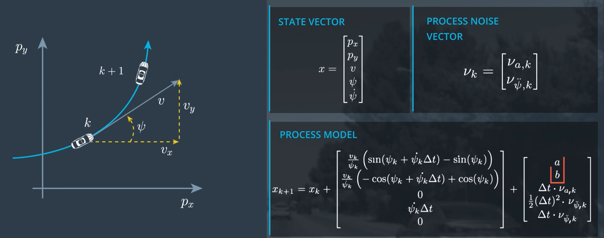
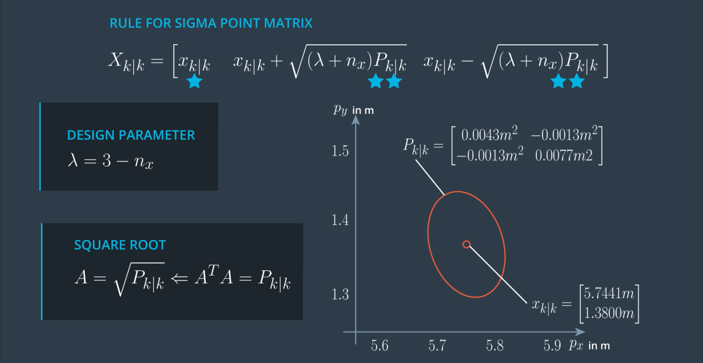
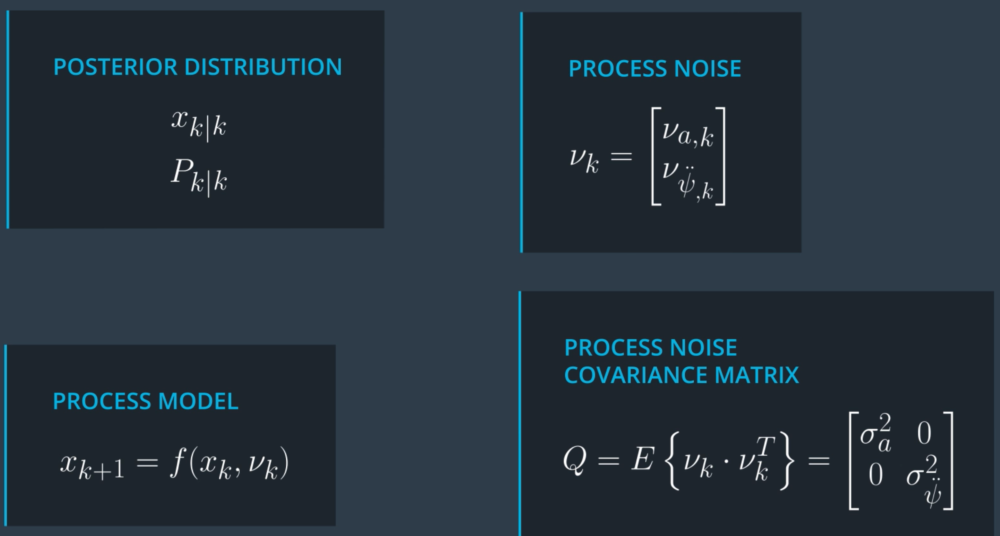
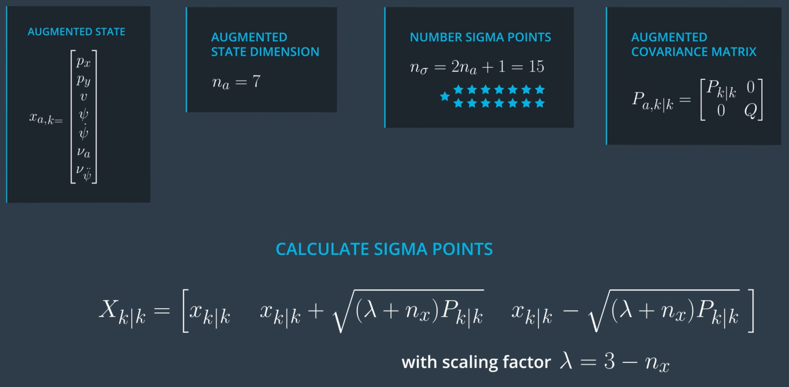

# Sensor Fusion - Unscented Kalman Filter


In this project I have implemented an Unscented Kalman Filter to estimate the state of multiple cars on a highway using noisy lidar and radar measurements.

The main program can be built and ran by doing the following from the project top directory.

1. mkdir build
2. cd build
3. cmake ..
4. make
5. ./ukf_highway


<!--img src="media/ukf_highway.png" width="700" height="400" /-->

`main.cpp` is using `highway.h` to create a straight 3 lane highway environment with 3 traffic cars and the main ego car at the center.
The viewer scene is centered around the ego car and the coordinate system is relative to the ego car as well. The ego car is green while the
other traffic cars are blue. The traffic cars will be accelerating and altering their steering to change lanes. Each of the traffic car's has
it's own UKF object generated for it, and will update each indidual one during every time step.

The red spheres above cars represent the (x,y) lidar detection and the purple lines show the radar measurements with the velocity magnitude along the detected angle. The Z axis is not taken into account for tracking, so you are only tracking along the X/Y axis.

---

## UKF Code Pipeline
```
* Prediction: 1. Generate Sigma Points
              2. Predict Sigma Points
              3. Predict Mean & Covariance

* Update:     1. Predict Measurement
              2. Update State
```
---
## CTRV Motion Model
For this project, Constant turn rate and velocity magnitude model (CTRV) motion model has been used.
State equation are derived as below.


### <strong>Final Equation</strong>


```
a = 1/2*((Δt)^2)*cos(ψk)⋅νa,k
b = 1/2*((Δt)^2)*sin(ψk)⋅νa,k
```
---
## Prediction
### Generating Sigma Points

Number of Sigma points equal to ``` 2*nx + 1```. Here, ```nx``` is number of states. Among these points one point is <strong>mean</strong> from the previous iteration and other points are in pair for each state.



Here, P<sub>k|k</sub> = the covariance matrix from previous iteration <br />
x<sub>k|k</sub> = mean from previous state<br />
X<sub>k|k</sub> = Vector containing the sigma points<br />
```k``` = the kth state<br />
&lambda;  = Design parameter<br />
```
  // create sigma point matrix
  MatrixXd Xsig = MatrixXd(n_x, 2 * n_x + 1);

  // calculate square root of P
  MatrixXd A = P.llt().matrixL();

  // set first column of sigma point matrix
  Xsig.col(0) = x;

  // set remaining sigma points
  for (int i = 0; i < n_x; ++i) {
    Xsig.col(i+1)     = x + sqrt(lambda+n_x) * A.col(i);
    Xsig.col(i+1+n_x) = x - sqrt(lambda+n_x) * A.col(i);
  }
  ```
### Augmentation of state matrix
So as to include the noises we here include noises as state parameters.



```
 // create augmented mean vector
  VectorXd x_aug = VectorXd(7);

  // create augmented state covariance
  MatrixXd P_aug = MatrixXd(7, 7);

  // create sigma point matrix
  MatrixXd Xsig_aug = MatrixXd(n_aug, 2 * n_aug + 1);

  // create augmented mean state
  x_aug.head(5) = x;
  x_aug(5) = 0;
  x_aug(6) = 0;

  // create augmented covariance matrix
  P_aug.fill(0.0);
  P_aug.topLeftCorner(5,5) = P;
  P_aug(5,5) = std_a*std_a;
  P_aug(6,6) = std_yawdd*std_yawdd;

  // create square root matrix
  MatrixXd L = P_aug.llt().matrixL();

  // create augmented sigma points
  Xsig_aug.col(0)  = x_aug;
  for (int i = 0; i< n_aug; ++i) {
    Xsig_aug.col(i+1)       = x_aug + sqrt(lambda+n_aug) * L.col(i);
    Xsig_aug.col(i+1+n_aug) = x_aug - sqrt(lambda+n_aug) * L.col(i);
  }
  ```
### Predict Sigma Points


```
// create matrix with predicted sigma points as columns
  MatrixXd Xsig_pred = MatrixXd(n_x, 2 * n_aug + 1);

  double delta_t = 0.1; // time diff in sec

  // predict sigma points
  for (int i = 0; i< 2*n_aug+1; ++i) {
    // extract values for better readability
    double p_x = Xsig_aug(0,i);
    double p_y = Xsig_aug(1,i);
    double v = Xsig_aug(2,i);
    double yaw = Xsig_aug(3,i);
    double yawd = Xsig_aug(4,i);
    double nu_a = Xsig_aug(5,i);
    double nu_yawdd = Xsig_aug(6,i);

    // predicted state values
    double px_p, py_p;

    // avoid division by zero
    if (fabs(yawd) > 0.001) {
        px_p = p_x + v/yawd * ( sin (yaw + yawd*delta_t) - sin(yaw));
        py_p = p_y + v/yawd * ( cos(yaw) - cos(yaw+yawd*delta_t) );
    } else {
        px_p = p_x + v*delta_t*cos(yaw);
        py_p = p_y + v*delta_t*sin(yaw);
    }

    double v_p = v;
    double yaw_p = yaw + yawd*delta_t;
    double yawd_p = yawd;

    // add noise
    px_p = px_p + 0.5*nu_a*delta_t*delta_t * cos(yaw);
    py_p = py_p + 0.5*nu_a*delta_t*delta_t * sin(yaw);
    v_p = v_p + nu_a*delta_t;

    yaw_p = yaw_p + 0.5*nu_yawdd*delta_t*delta_t;
    yawd_p = yawd_p + nu_yawdd*delta_t;

    // write predicted sigma point into right column
    Xsig_pred(0,i) = px_p;
    Xsig_pred(1,i) = py_p;
    Xsig_pred(2,i) = v_p;
    Xsig_pred(3,i) = yaw_p;
    Xsig_pred(4,i) = yawd_p;
  }
```

### Predict Mean &  Covariance


## Other Important Dependencies
* cmake >= 3.5
  * All OSes: [click here for installation instructions](https://cmake.org/install/)
* make >= 4.1 (Linux, Mac), 3.81 (Windows)
  * Linux: make is installed by default on most Linux distros
  * Mac: [install Xcode command line tools to get make](https://developer.apple.com/xcode/features/)
  * Windows: [Click here for installation instructions](http://gnuwin32.sourceforge.net/packages/make.htm)
* gcc/g++ >= 5.4
  * Linux: gcc / g++ is installed by default on most Linux distros
  * Mac: same deal as make - [install Xcode command line tools](https://developer.apple.com/xcode/features/)
  * Windows: recommend using [MinGW](http://www.mingw.org/)
 * PCL 1.2

## Basic Build Instructions

1. Clone this repo.
2. Make a build directory: `mkdir build && cd build`
3. Compile: `cmake .. && make`
4. Run it: `./ukf_highway`
